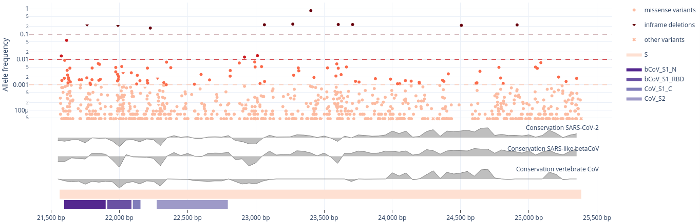

-----------------

# CoVigator: monitoring SARS-CoV-2 mutations

[](https://badge.fury.io/py/covigator)
[](https://github.com/TRON-Bioinformatics/covigator/actions/workflows/unit_tests.yml)
[](https://dash.plotly.com/)
[](https://opensource.org/licenses/MIT)


Human infections with SARS-CoV-2 are spreading globally since the beginning of 2020, necessitating preventive or 
therapeutic strategies and first steps towards an end to this pandemic were done with the approval of the first mRNA 
vaccines against SARS-CoV-2. We want to provide an interactive view on different types of mutations that can be 
incorporated in global efforts to sustainably prevent or treat infections. Thus, we envision to help guiding global 
vaccine design efforts to overcome the threats of this pandemic.

CoVigator is a monitoring system for SARS-CoV-2 which integrates a full variant calling pipeline, 
a database that stores all relevant information about mutations in SARS-CoV-2, a dashboard to enable visual analytics
and finally an Application Programming Interface to make the data programmatically available.

https://covigator.tron-mainz.de/

CoVigator loads publicly available SARS-CoV-2 DNA sequences from two systems:

* European Nucleotide Archive (ENA) providing raw reads in FASTQ format
* Global Initiative on Sharing Avian Influenza Data (GISAID) providing assemblies in FASTA format

The dashboard is implemented in the popular visualization framework Dash . 
The computation is distributed through our cluster with a library of similar name and popularity Dask .
The analysis pipeline is implemented in the Nextflow framework , for full details go to 
.


  Figure 1: Sample accumulation by country


  Figure 2: Most frequent mutations in the spike gene


The CoVigator project was developed at the Biomarker Development Center at 
TRON (Translational Oncology at the University Medical Center of the Johannes Gutenberg University gGmbH). 
The project was kindly supported by Intel´s Pandemic Response Technology Initiative .

If you want to cite us:

* Schrörs, B., Gudimella, R., Bukur, T., Rösler, T., Löwer, M., & Sahin, U. (2021). Large-scale analysis of SARS-CoV-2 spike-glycoprotein mutants demonstrates the need for continuous screening of virus isolates. BioRxiv, 2021.02.04.429765. 

## System architecture

The system architecture has the following components:
- **Database**: data storage
- **Accessor**: queries external systems (ie: ENA and GISAID) for new samples and registers all necessary raw data and 
  metadata to be analysed
- **Processor**: reads data from new samples and process it through a workflow with multiple steps to generate the 
  analysis ready data
- **Dashboard**: a web application reading data from the database and presenting through tables and visualizations
- **API**: a set of REST endpoints that make the data available (TODO)


While accessor and processor are backend processes that are intended to run asynchronously and periodically, 
the dashboard and API are publicly reachable by end users.

Although the initial use case for Covigator is SARS-CoV-2 data, it is intended to be usable with other infectious 
organisms.

## Database configuration

Required database is Postgres 13.

All Covigator modules require access to the database. This is configured through environment variables.

- `COVIGATOR_DB_HOST`: the host of the database (default value 0.0.0.0)
- `COVIGATOR_DB_NAME`: the database name inside Postgres (default value: covigator)
- `COVIGATOR_DB_USER`: the database user (default value: covigator)
- `COVIGATOR_DB_PASSWORD`: the database password (default value: covigator)
- `COVIGATOR_DB_PORT`: the database port (default value: 5432)
- `COVIGATOR_DB_POOL_SIZE`: the database pool size (default value: 5)
- `COVIGATOR_DB_MAX_OVERFLOW`: the database max overflow (default value: 10)
- `COVIGATOR_TABLE_VERSION`: this suffix is appended to all table names when provided

## Accessor

The accessor queries external systems, checks in the database which samples are new and creates the required entries 
in the database.
The accessor is intended to run periodically.
The accessor uses the European Nucleotide Archive (ENA) to fetch NGS raw data and GSAID to fetch assemblies. 
The accessor does not download large raw files, but only the sample metadata, the URLs and MD5 check sums required to download the data.
The accessor implements a retry mechanism with an exponential backoff to manage temporary failures of 
service of any external data provider.

### Usage

For ENA:
`covigator-ena-accessor --tax-id 2697049 --host-tax-id 9606`

- The organism taxonomic identifier (eg: for SARS-CoV-2 the taxonomic identifier is 2697049)
- The host organism taxonomic identifier (eg: for Homo sapiens the taxonomic identifier is 9606)

The taxonomic identifiers for the different organisms is available through EMBL-EBI as described here https://ena-docs.readthedocs.io/en/latest/retrieval/programmatic-access/taxon-api.html or through NCBI here https://www.ncbi.nlm.nih.gov/taxonomy.


For GISAID:
`covigator-gisaid-accessor --input-fasta gisaid_dna.fasta --input-metadata gisaid.tsv`

The input files for GISAID need to be downloaded manually from GISAID site after accepting their license.

## Processor

The processor is in charge of orchestrating the load of samples into the database. 
The processor is intended to run periodically.
This jobs created by the accessor are the starting point for the processor which orchestrates the flow of the job 
through its life cycle.

The happy path of a job is the following:
- `PENDING`: newly created job by the accessor
- `QUEUED`: the job has already been read by the processor and the subsequent actions are scheduled
- `DOWNLOADED`: intermediate state between the downloader and the pipeline
- `PROCESSED`: intermediate state between the pipeline and the clean up
- `LOADED`: variants have been loaded into the database
- `FINISHED`: cooccurrence has been loaded into the database
  
The failure states are the following and are self descriptive
- `FAILED_DOWNLOAD`
- `FAILED_PROCESSING`
- `FAILED_LOAD`
- `FAILED_COOCCURRENCE`

A timestamp is stored for every change of state. The failure states also stores an error message for debugging purposes.


The above workflow is orchestrated using the dask library and a Slurm cluster behind the scenes. The cluster 
configuration is specific to Dask, thus Covigator could be integrated into other clusters than Slurm. 
Also, it can run on a single computer without any cluster by specifiying the number of available CPUs. 

The tasks managed in this workflow are not computationally intensive and each uses a single CPU and a low amount of memory.

### Input data

- `--source` The data source to process. Possible values: ENA, GISAID. Required: true
- `--num-jobs` The number of dask jobs to spin, this corresponds to the number of whole nodes requested to the cluster. Default: 1

To run locally out of a cluster use `--local` and `--num-local-cpus`.

### Configuration

The dask cluster requires to be configured in a jobqueue.yaml file as described here https://docs.dask.org/en/latest/configuration.html.
It is specially important to configure dask so processes are not spilled to disk in order to avoid causing troubles in 
the cluster shared disk. This file can be read from `~/.config/dask`, from `/etc/dask` or from the environment variable 
DASK_ROOT_CONFIG.

```
jobqueue:

   slurm:
     name: dask-worker

     # Dask worker options
     cores: 96                    # Total number of cores per job
     memory: "100 GB"             # Total amount of memory per job
     processes: 24                # Number of Python processes per job

     interface: null              # Network interface to use like eth0 or ib0
     death-timeout: 60            # Number of seconds to wait if a worker can not find a scheduler
     local-directory: null        # Location of fast local storage like /scratch or $TMPDIR
     extra: []

     # SLURM resource manager options
     shebang: "#!/usr/bin/env bash"
     queue: "CoViD-19"
     project: null
     walltime: '00:30:00'
     env-extra: []
     job-cpu: null
     job-mem: null
     job-extra: ["-A priesgof"]
     log-directory: null
    
     # Scheduler options
     scheduler-options: {}

distributed:
  worker:
    memory:
      target: false  # don't spill to disk
      spill: false  # don't spill to disk
      pause: 0.80  # pause execution at 80% memory use
      terminate: 0.95  # restart the worker at 95% use
```

### Usage

`covigator-processor --num-jobs 1 --source ENA`

### Processes within the workflow

#### Downloader

The downloader requires the path where downloaded files will be stored. 
The configuration is done through environment variables.

- `COVIGATOR_STORAGE_FOLDER`: the folder where files will be stored by the downloaded (default value `./data/covigator`)

The downloader takes an ENA run, downloads all of its FASTQs, 
stores them in a folder structures such as `$COVIGATOR_STORAGE_FOLDER/${run_accession}` 
(eg: `/covigator/data/ERR12345/ERR12345.fastq.gz`) and then checks the MD5 checksum of the 
downloaded files.

The downloader streams large files into disk without holding them into memory, thus enabling the download of large files.
The downloader implements a retry mechanism with an exponential backoff to manage temporary failures of 
service of any external data provider.

#### Pipeline

The pipeline for NGS data is implemented in a separate Nextflow workflow here 
https://github.com/TRON-Bioinformatics/covigator-ngs-pipeline.

The integration of Nextflow within the processor requires to set the Java home for Nextflow and the Nextflow binary file.
```
export NXF_JAVA_HOME=/usr/lib/jvm/java-11-openjdk-amd64
export COVIGATOR_NEXTFLOW=/bin/nextflow
export COVIGATOR_TEMP_FOLDER=/covigator/data/temp
```

Clone the Nextflow workflow as follows:
```
cd /covigator/dependencies
git clone --branch v0.3.1 https://github.com/TRON-Bioinformatics/covigator-ngs-pipeline.git
```

And then point the right environment variables to the pipeline:
```
export COVIGATOR_WORKFLOW=/covigator/dependencies/covigator-ngs-pipeline/main.nf
```

But before running the covigator processor you will need to make sure that the adequate conda environment is already 
created, otherwise concurrent creations of the same environment will cause an error.
There is an initialization mode for this purpose.
Make sure that the work folder is set to COVIGATOR_TEMP_FOLDER.
```
nextflow run /covigator/dependencies/covigator-ngs-pipeline/main.nf --initialize -profile conda -work-dir $COVIGATOR_TEMP_FOLDER
```

#### Loader

Reads the outcoming VCF files of the pipeline and load them into the database.
It stores variants in two tables:
- Unique variants, the variant as an abstract concept with the annotations not sample specific, (eg: variant effect, non synonymous)
- Variant observations, specific observation of a variant in a given sample with the sample specific annotations (eg: depth of coverage)

#### Cooccurrence

Computes the cooccurrence matrix incrementally for every new sample.
Increases the count of every pairwise combination of variants within the new sample.
It stores the cooccurrence matrix in one single table indexed by two variants. Only the lower diagonal is stored.


## Reference data

- DNA reference: ftp://ftp.ensemblgenomes.org/pub/viruses/fasta/sars_cov_2/dna/Sars_cov_2.ASM985889v3.dna.toplevel.fa.gz
- Peptides reference: ftp://ftp.ensemblgenomes.org/pub/viruses/fasta/sars_cov_2/pep/Sars_cov_2.ASM985889v3.pep.all.fa.gz
- Gene and protein domain annotations: ftp://ftp.ensemblgenomes.org/pub/viruses/json/sars_cov_2/sars_cov_2.json
