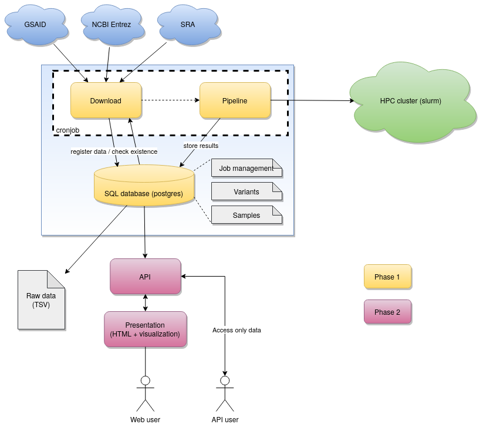
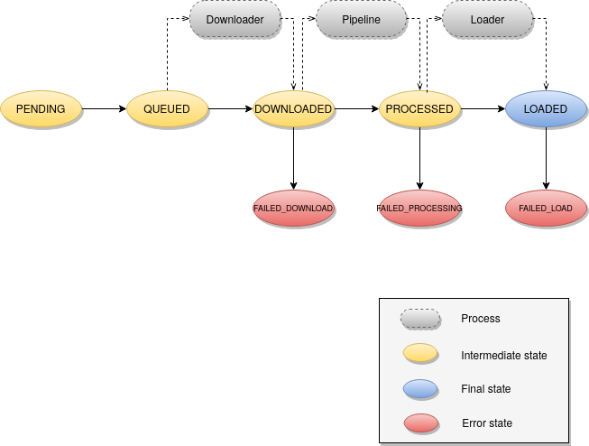

# CoVigator (Corona Navigator)

CoVigator is a fully automatized SARS-CoV-2 analysis pipeline integrating the following major steps:

* Generation/Download of Reference DBs
* Starting of different workflows depending of input data type (e.g. RNA-Seq, Assembly)

The system architecture has the following components:
- **Database**: all other modules need access to the database
- **Accessor**: queries external systems for new data and creates an entry in the local database with all necessary metadata
- **Processor**: reads from the database samples to be processed and triggers a workflow with multiple steps
    - Download: downloads the necessary FASTQ files
    - Pipeline: triggers a variant calling pipeline which outputs VCF files
    - Delete: deletes the FASTQ files
    - Load: loads the variants from VCF files into the database
    - Cooccurrence matrix: once the variants from a sample have been loaded the cooccurrence matrix is updated
- **Dashboard**: a web application reading data from the database and presenting through tables and visualizations

While accessor and processor are backend processes that are intended to run asynchronously and periodically, the dashboard is accessible by end users.

Although the initial use case for Covigator is SARS-CoV-2 data, it is intended to be usable with other infectious organisms.



## Database configuration

Required database is Postgres 13.

All Covigator modules require access to the database. This is configured through environment variables.

- `COVIGATOR_DB_HOST`: the host of the database (default value 0.0.0.0)
- `COVIGATOR_DB_NAME`: the database name inside Postgres (default value: covigator)
- `COVIGATOR_DB_USER`: the database user (default value: covigator)
- `COVIGATOR_DB_PASSWORD`: the database password (default value: covigator)
- `COVIGATOR_DB_PORT`: the database port (default value: 5432)
- `COVIGATOR_DB_POOL_SIZE`: the database pool size (default value: 5)
- `COVIGATOR_DB_MAX_OVERFLOW`: the database max overflow (default value: 10)
- `COVIGATOR_TABLE_VERSION`: this suffix is appended to all table names when provided

## Accessor

The accessor queries external systems, checks in the database which samples are new and creates the required entries in the database.
The accessor is intended to run periodically.
The accessor currently uses the European Nucleotide Archive (ENA) to fetch NGS raw data and it is intended to use GSAID to fetch assemblies in the future.
The accessor does not download large raw files, but only the sample metadata, the URLs and MD5 check sums required to download the data.
The accessor implements a retry mechanism with an exponential backoff to manage temporary failures of 
service of any external data provider.

### Input data

- The organism taxonomic identifier (eg: for SARS-CoV-2 the taxonomic identifier is 2697049)
- The host organism taxonomic identifier (eg: for Homo sapiens the taxonomic identifier is 9606)

The taxonomic identifiers for the different organisms is available through EMBL-EBI as described here https://ena-docs.readthedocs.io/en/latest/retrieval/programmatic-access/taxon-api.html or through NCBI here https://www.ncbi.nlm.nih.gov/taxonomy.

### Usage

`covigator-ena-accessor --tax-id 2697049 --host-tax-id 9606`

## Processor

The processor is in charge of orchestrating the load of samples into the database. 
The processor is intended to run periodically.
Whenever the accessor finds a new sample not present in the database it stores all the required sample metadata and it 
creates a new job. 
This job is the starting point for the processor which orchestrates the flow of the job through its life cycle.

The happy path of a job is the following:
- `PENDING`: newly created job by the accessor
- `QUEUED`: the job has already been read by the processor and the subsequent actions are scheduled
- `DOWNLOADED`: intermediate state between the downloader and the pipeline
- `PROCESSED`: intermediate state between the pipeline and the clean up
- `LOADED`: variants have been loaded into the database
- `FINISHED`: cooccurrence has been loaded into the database
  
The failure states are the following and are self descriptive
- `FAILED_DOWNLOAD`
- `FAILED_PROCESSING`
- `FAILED_LOAD`
- `FAILED_COOCCURRENCE`

There is a cleanup task that happens after processing in parallel to the load process, 
but this is not a state of the job and failures in the cleanup although logged in the database do not stop a job from 
reaching the final state.

A timestamp is stored for every change of state. The failure states also stores an error message.



The above workflow is orchestrated using dask library and a Slurm cluster behind the scenes. Although dask supports
multiple queue implementations, covigator only does support Slurm.

The different processes have different priorities to ensure that the graph of tasks is processed in a depth first order.
This is relevant when processing a large amount of jobs to avoid that all jobs are first downloaded, thus requiring that 
all raw files are stored in the file system simultaneously.
The tasks managed in this workflow are not computationally intensive and each uses a single CPU and a low amount of memory.

### Input data

- `--source` The data source to process. Possible values: ENA, GISAID. Required: true
- `--num-jobs` The number of dask jobs to spin, this corresponds to the number of whole nodes requested to the cluster. Default: 1

### Configuration

The dask cluster requires to be configured in a jobqueue.yaml file as described here https://docs.dask.org/en/latest/configuration.html.
It is specially important to configure dask so processes are not spilled to disk in order to avoid causing troubles in 
the cluster shared disk. This file can be read from `~/.config/dask`, from `/etc/dask` or from the environment variable 
DASK_ROOT_CONFIG.

```
jobqueue:

   slurm:
     name: dask-worker

     # Dask worker options
     cores: 96                    # Total number of cores per job
     memory: "100 GB"             # Total amount of memory per job
     processes: 24                # Number of Python processes per job

     interface: null              # Network interface to use like eth0 or ib0
     death-timeout: 60            # Number of seconds to wait if a worker can not find a scheduler
     local-directory: null        # Location of fast local storage like /scratch or $TMPDIR
     extra: []

     # SLURM resource manager options
     shebang: "#!/usr/bin/env bash"
     queue: "CoViD-19"
     project: null
     walltime: '00:30:00'
     env-extra: []
     job-cpu: null
     job-mem: null
     job-extra: ["-A priesgof"]
     log-directory: null
    
     # Scheduler options
     scheduler-options: {}

distributed:
  worker:
    memory:
      target: false  # don't spill to disk
      spill: false  # don't spill to disk
      pause: 0.80  # pause execution at 80% memory use
      terminate: 0.95  # restart the worker at 95% use
```

### Usage

`covigator-processor --num-jobs 1 --source ENA`

### Processes within the workflow

#### Downloader

The downloader requires the path where downloaded files will be stored. 
The configuration is done through environment variables.

- `COVIGATOR_STORAGE_FOLDER`: the folder where files will be stored by the downloaded (default value `./data/covigator`)


The downloader takes an ENA run, downloads all of its FASTQs, 
stores them in a folder structures such as `$COVIGATOR_STORAGE_FOLDER/${run_accession}` 
(eg: `/covigator/data/ERR12345/ERR12345.fastq.gz`) and then checks the MD5 checksum of the 
downloaded files.

The downloader streams large files into disk without holding them into memory, thus enabling the download of large files.
The downloader implements a retry mechanism with an exponential backoff to manage temporary failures of 
service of any external data provider.

#### Pipeline

The pipeline for NGS data is implemented in a separate Nextflow workflow here 
https://github.com/TRON-Bioinformatics/covigator-ngs-pipeline.

The integration of Nextflow within the processor requires to set the Java home for Nextflow and the Nextflow binary file.
```
export NXF_JAVA_HOME=/usr/lib/jvm/java-11-openjdk-amd64
export COVIGATOR_NEXTFLOW=/bin/nextflow
export COVIGATOR_TEMP_FOLDER=/covigator/data/temp
```

Clone the Nextflow workflow and its dependencies as follows:
```
cd /covigator/dependencies
git clone --branch v0.3.1 https://github.com/TRON-Bioinformatics/covigator-ngs-pipeline.git
git clone --branch v1.4.0 https://github.com/TRON-Bioinformatics/tronflow-bwa.git
git clone --branch v1.5.0 https://github.com/TRON-Bioinformatics/tronflow-bam-preprocessing.git
git clone --branch v1.1.0 https://github.com/TRON-Bioinformatics/tronflow-variant-normalization.git
```

And then point the right environment variables to these pipelines:
```
export COVIGATOR_WORKFLOW=/covigator/dependencies/covigator-ngs-pipeline/main.nf
export COVIGATOR_TRONFLOW_BWA=/covigator/dependencies/tronflow-bwa/main.nf
export COVIGATOR_TRONFLOW_BAM_PREPROCESSING=/covigator/dependencies/tronflow-bam-preprocessing/main.nf
export COVIGATOR_TRONFLOW_VARIANT_NORMALIZATION=/covigator/dependencies/tronflow-variant-normalization/main.nf
```

But before running the covigator processor you will need to make sure that the adequate conda environments are already 
created, otherwise concurrent creations of the same environment will cause an error.

For each of the workflows move into its folder and run the tests dataset making sure that the work folder is 
COVIGATOR_TEMP_FOLDER.
```
cd /covigator/dependencies/tronflow-bwa/
nextflow run main.nf -profile conda,test -work-dir $COVIGATOR_TEMP_FOLDER
```


#### Clean up

Deletes the FASTQ files and eventually intermediate files left behind by the pipeline.

#### Loader

Reads the outcoming VCF files of the pipeline and load them into the database.
It stores variants in two tables:
- Unique variants, the variant as an abstract concept with the annotations not sample specific, (eg: variant effect, non synonymous)
- Variant observations, specific observation of a variant in a given sample with the sample specific annotations (eg: depth of coverage)

#### Cooccurrence

Computes the cooccurrence matrix incrementally for every new sample.
Increases the count of every pairwise combination of variants within the new sample.
It stores the cooccurrence matrix in one single table indexed by two variants. Only the lower diagonal is stored.


## Developer guide

### Setup your development environment

1. Create a virtual environment `virtualenv venv` making sure you are using a Python >= 3.6 interpreter.
2. Activate your virtual environment `source venv/bin/activate`
3. Install all dependencies `pip install -r requirements.txt`

### Tests

There are two type of tests:
- **Unit tests**. This need to have two attributes: being fast (in the order of milliseconds) and not depending on any external resource. The objective is to run these constantly during development and in a continuous integration environment and to provide a fast feedback loop. These are under `covigator.tests.unit_tests`
- **Integration tests**. This tests are normally more complex, involve multiple components of the application and/or external resources, and they can be slow. These tests are not intended for automation.  These are under `covigator.tests.integration_tests`

Tests can be run from an IDE like PyCharm or otherwise from the commmand line.

Run all tests as follows:
`python -m unittests discover covigator.tests.unit_tests`

Run a specific test as follows:
`python -m unittest covigator.tests.unit_tests.test_vcf_loader`

**NOTE**: unit tests can make use of the database by initialising it as `Database(test=True)` will start an empty in memory SQLite database.

### Install the Python package

1. Build the binary: `python setup.py bdist_wheel`
2. Install covigator: `pip install dist/covigator-x.y.z-py3-none-any.whl`

After installation there will be two endpoints available in the path: `covigator-download` and `covigator-pipeline`.

### Setup the database

Given a working Postgres database:

1. Connect to the default database: `psql -W postgres`
2. Create a user for covigator `CREATE USER covigator WITH PASSWORD 'covigator';`
3. Create a database: CREATE DATABASE covigator OWNER covigator;

### Configure access to the database

The application expects some environment variables to be configured with the credentials to the database:
```
COVIGATOR_DB_HOST=0.0.0.0
COVIGATOR_DB_NAME=covigator
COVIGATOR_DB_USER=covigator
COVIGATOR_DB_PASSWORD=covigator
COVIGATOR_DB_PORT=5432
```

If these are not provided it will use the values shown above as default values.

## References

- DNA reference: ftp://ftp.ensemblgenomes.org/pub/viruses/fasta/sars_cov_2/dna/Sars_cov_2.ASM985889v3.dna.toplevel.fa.gz
- Peptides reference: ftp://ftp.ensemblgenomes.org/pub/viruses/fasta/sars_cov_2/pep/Sars_cov_2.ASM985889v3.pep.all.fa.gz
- Gene and protein domain annotations: ftp://ftp.ensemblgenomes.org/pub/viruses/json/sars_cov_2/sars_cov_2.json
