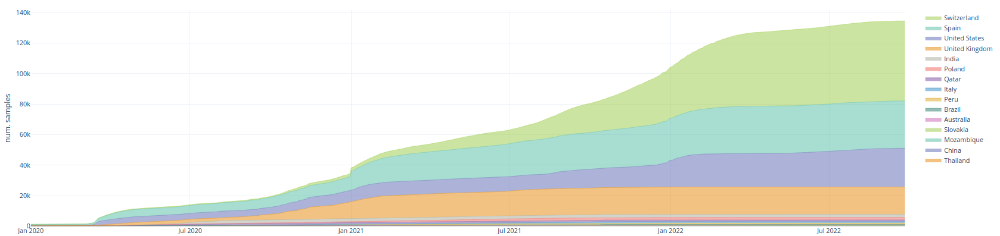

-----------------

# CoVigator: monitoring SARS-CoV-2 mutations

**CoVigator dashboard**: [https://covigator.tron-mainz.de](https://covigator.tron-mainz.de)

**CoVigator documentation**: [https://covigator.readthedocs.io/](https://covigator.readthedocs.io)

Human infections with SARS-CoV-2 are spreading globally since the beginning of 2020, necessitating preventive or 
therapeutic strategies and first steps towards an end to this pandemic were done with the approval of the first mRNA 
vaccines against SARS-CoV-2. 
The accumulation of virus samples that have been sequenced in a short time frame is unprecedented (see Figure 1).
This is the first pandemic recorded at a molecular level with such level of detail giving us the opportunity to develop
new tools for the monitoring of its evolution.

We want to provide an up-to-date interactive view on SARS-CoV-2 mutations to support global efforts in preventing or 
treating infections. 
Monitoring the appearance of relevant new mutations is key to enable a fast reaction to new strains and for that 
purpose we enable the exploration of these mutations and their annotations (see Figure 2). 
Thus, we envision to help guiding global vaccine design efforts to overcome the threats of this pandemic.

CoVigator is a monitoring system for SARS-CoV-2 which integrates a full variant calling pipeline, 
a database that stores all relevant information about mutations in SARS-CoV-2 and finally a dashboard to enable 
visual analytics.

<b>Figure 1: Sample accumulation by country</b>

* European Nucleotide Archive (ENA) providing raw reads in FASTQ format
* Global Initiative on Sharing Avian Influenza Data (GISAID) providing assemblies in FASTA format

<b>Figure 2: Most frequent mutations in the spike protein</b>

CoVigator loads publicly available SARS-CoV-2 DNA sequences from two databases:

* [European Nucleotide Archive (ENA)](https://www.ebi.ac.uk/ena) providing raw reads in FASTQ format.
* [Global Initiative on Sharing Avian Influenza Data (GISAID)](https://www.gisaid.org/) providing assemblies in FASTA 
  format.

There is certain overlap in the samples present in ENA and GISAID as some national initiatives are systematically 
reporting to both databases. ENA enables a higher resolution into the SARS-CoV-2 mutation details through the individual 
reads. This allows us to annotate mutations with a Variant Allele Frequency (VAF) and explore intrahost 
mutations. On the other hand, while we load all of the GISAID database in CoVigator, we only process the Illumina 
samples from ENA. This means excluding all of the Oxford Nanopore samples and hence having a partial view of all the 
available data.

The dashboard is implemented in the visualization framework [Dash](https://dash.plotly.com/). 
The computation is distributed through our cluster with a library of similar name [Dask](https://dask.org/).
The analysis pipeline is implemented in the [Nextflow](https://www.nextflow.io/) framework.

The CoVigator project was developed at the Biomarker Development Center at 
[TRON (Translational Oncology at the University Medical Center of the Johannes Gutenberg University gGmbH)](https://tron-mainz.de/). 
The project was kindly supported by 
[Intel´s Pandemic Response Technology Initiative](https://newsroom.intel.com/tag/pandemic-response-technology-initiative).

## How to cite

* Schrörs, B., Riesgo-Ferreiro, P., Sorn, P., Gudimella, R., Bukur, T., Rösler, T., Löwer, M., & Sahin, U. (2021). 
  Large-scale analysis of SARS-CoV-2 spike-glycoprotein mutants demonstrates the need for continuous screening of virus 
  isolates. PLOS ONE, 16(9), e0249254. [10.1371/journal.pone.0249254](https://doi.org/10.1371/journal.pone.0249254)
