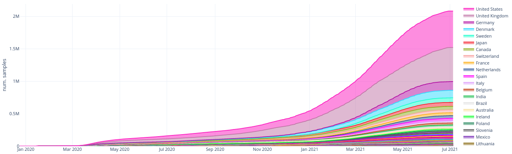
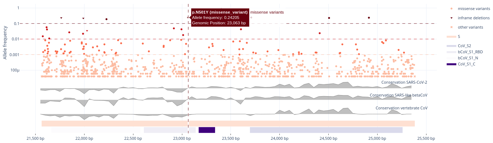

-----------------

# Overview

Human infections with SARS-CoV-2 are spreading globally since the beginning of 2020, necessitating preventive or 
therapeutic strategies and first steps towards an end to this pandemic were done with the approval of the first mRNA 
vaccines against SARS-CoV-2. We want to provide an interactive view on different types of mutations that can be 
incorporated in global efforts to sustainably prevent or treat infections. Thus, we envision to help guiding global 
vaccine design efforts to overcome the threats of this pandemic.

CoVigator is a monitoring system for SARS-CoV-2 which integrates a full variant calling pipeline, 
a database that stores all relevant information about mutations in SARS-CoV-2 and finally a dashboard to enable 
visual analytics

CoVigator loads publicly available SARS-CoV-2 DNA sequences from two systems:

* European Nucleotide Archive (ENA) providing raw reads in FASTQ format. [https://www.ebi.ac.uk/ena](https://www.ebi.ac.uk/ena)
* Global Initiative on Sharing Avian Influenza Data (GISAID) providing assemblies in FASTA format. [https://www.gisaid.org/](https://www.gisaid.org/)

The dashboard is implemented in the popular visualization framework Dash [https://dash.plotly.com/](https://dash.plotly.com/). 
The computation is distributed through our cluster with a library of similar name and popularity Dask [https://dask.org/](https://dask.org/).
The analysis pipeline is implemented in the Nextflow framework [https://www.nextflow.io/](https://www.nextflow.io/).

  Figure 1: Sample accumulation by country

  Figure 2: Most frequent mutations in the spike gene

The CoVigator project was developed at the Biomarker Development Center at 
TRON (Translational Oncology at the University Medical Center of the Johannes Gutenberg University gGmbH). 
The project was kindly supported by Intel´s Pandemic Response Technology Initiative 
[https://newsroom.intel.com/tag/pandemic-response-technology-initiative](https://newsroom.intel.com/tag/pandemic-response-technology-initiative).

## How to cite

* Schrörs, B., Riesgo-Ferreiro, P., Sorn, P., Gudimella, R., Bukur, T., Rösler, T., Löwer, M., & Sahin, U. (2021). 
  Large-scale analysis of SARS-CoV-2 spike-glycoprotein mutants demonstrates the need for continuous screening of virus 
  isolates. PLOS ONE, 16(9), e0249254. [https://doi.org/10.1371/journal.pone.0249254](https://doi.org/10.1371/journal.pone.0249254)

## Open source

All the code for CoVigator is open source and made available under the MIT license. 
We welcome any contribution in any of our code repositories. If you have trouble using CoVigator or you find an issue, 
we will be thankful if you would report a ticket in GitHub.

Our repositories:
* CoVigator knowleged base and dashboard: [https://github.com/TRON-Bioinformatics/covigator](https://github.com/TRON-Bioinformatics/covigator)
* CoVigator analysis pipeline: [https://github.com/TRON-Bioinformatics/covigator-ngs-pipeline](https://github.com/TRON-Bioinformatics/covigator-ngs-pipeline)
* CoVigator data analysis playing ground: [https://github.com/TRON-Bioinformatics/covigator-analysis](https://github.com/TRON-Bioinformatics/covigator-analysis)

## About TRON

TRON is an independent biopharmaceutical non-profit translational research organization pursuing 
new diagnostics and drugs for the treatment of cancer and other diseases with high medical need. 
We focus our transdisciplinary competencies in genomics and immunology to 1) develop novel platforms for the 
identification and validation of “omics”-based biomarkers and 2) for harnessing and 2) modulating immune system 
components, for use in personalized therapies. 
Partnering with academia and industry, TRON executes research at the leading edge to support innovative drug design 
for human health.

[https://tron-mainz.de/](https://tron-mainz.de/)

## Acknowledgements

Intel is committed to accelerating access to technology that can combat the current pandemic and enable scientific 
discovery that better prepares our world for future crises. Funding for this solution was funded in part by
[Intel’s Pandemic Response Technology Initiative"](https://newsroom.intel.com/news/intel-commits-technology-response-combat-coronavirus/). 
For more information about healthcare solutions from Intel, visit intel.com/healthcare. 
For more information about Intel’s COVID-19 response, visit 
[intel.com/COVID-19](https://www.intel.com/content/www/us/en/corporate-responsibility/covid-19-response.html).

We thank Franziska Lang and Özlem Muslu for critical discussions. We thank Rudolf Koopmann for his contribution to 
integrate Pangolin into the CoVigator pipeline.

We gratefully acknowledge all data contributors, i.e. the Authors and their Originating laboratories responsible for 
obtaining the specimens, and their Submitting laboratories for generating the genetic sequence and metadata and sharing 
via the GISAID Initiative (1) and the European Nucleotide Archive (2), on which this research is based.

1) Elbe, S., and Buckland-Merrett, G. (2017) Data, disease and diplomacy: GISAID’s innovative contribution to global 
   health. Global Challenges, 1:33-46. DOI: 10.1002/gch2.1018 PMCID: 31565258
2) Leinonen, R., Akhtar, R., Birney, E., Bower, L., Cerdeno-Tárraga, A., Cheng, Y., Cleland, I., Faruque, N., 
   Goodgame, N., Gibson, R., Hoad, G., Jang, M., Pakseresht, N., Plaister, S., Radhakrishnan, R., Reddy, K., 
   Sobhany, S., Hoopen, P. Ten, Vaughan, R., Zalunin V., Cochrane, G. (2011). The European nucleotide archive. 
   Nucleic Acids Research, 39(SUPPL. 1), D28. https://doi.org/10.1093/nar/gkq967

------------------------

[DATA PROTECTION](href="https://tron-mainz.de/data-protection/)

[IMPRINT](https://tron-mainz.de/imprint/)
