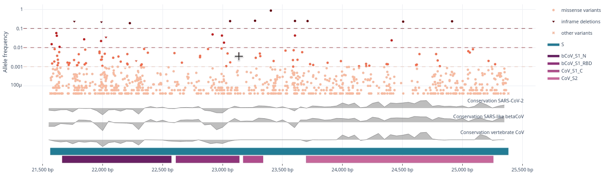
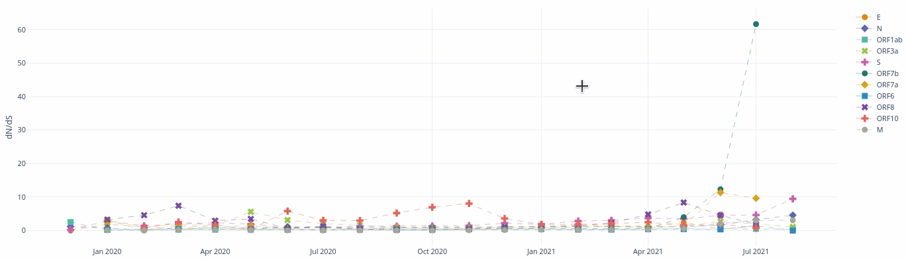
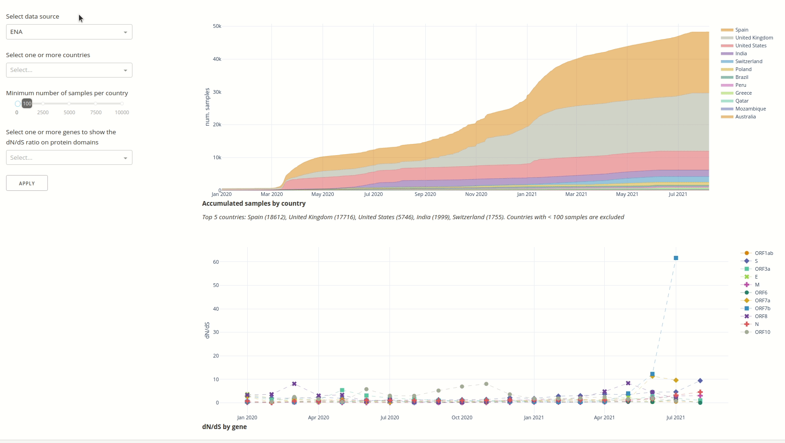
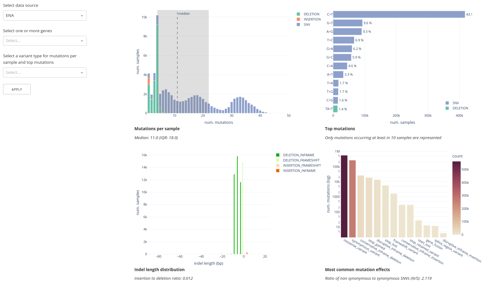
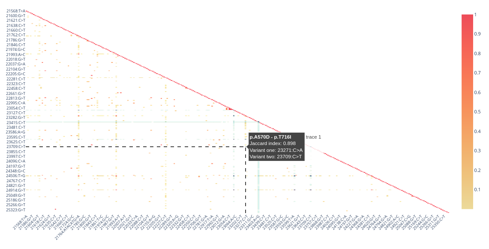
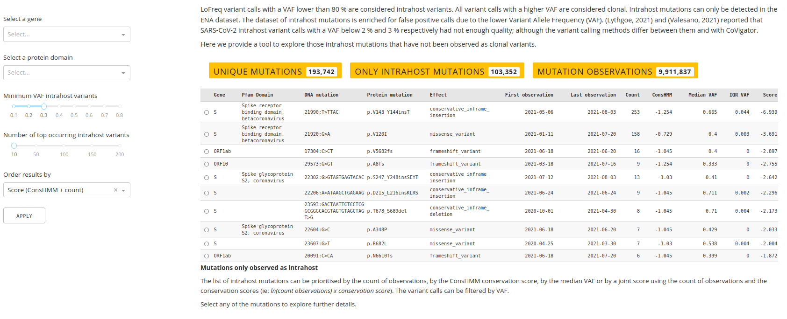
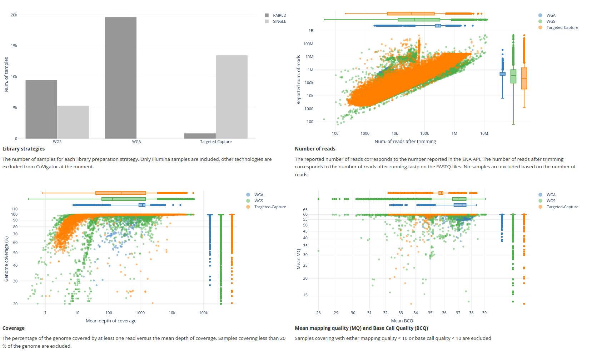
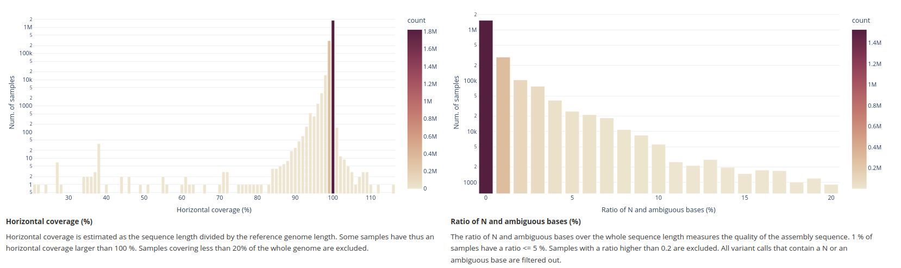

-----------------

# Dashboard

The Covigator dashboard provides the ability to navigate the dataset of mutations derived from ENA and GISAID through 
a series of interactive plots. Our aim is to enable users to understand trends in the dataset of mutations in its 
geographical and temporal context. The dashboard is implemented in Dash (https://dash.plotly.com/) which is based on 
Plotly a well known library for interactive plotting.

The code is open sourced in a repository for the dashboard and the knowledge base 
[https://github.com/TRON-Bioinformatics/covigator](https://github.com/TRON-Bioinformatics/covigator).

Here we provide details on the analysis methodology and how to use and interpret the plots in the dashboard.
The dashboard is organized in tabs, here we explore each of the tabs.

**Table of Contents**

1. [How to use an interactive Dash plot](#id1)
2. [The samples by country tab](#id2)
3. [The mutation statistics tab](#id3)
4. [The recurrent mutations tab](#id4)
5. [The intrahost mutations tab](#id5)
6. [The ENA dataset tab](#id6)
7. [The GISAID dataset tab](#id7)
8. [Download the raw data](#id8)

## How to use an interactive Dash plot

Plotly provides several interactive features, some are more intuitive than others, here we show how to zoom and
filter data. This is applicable on all plots in CoVigator.

### Zooming

You can zoom into any region of a plot. Click and drag on the plot to zoom-in and double-click to reset. 

### Filtering

Elements from a plot can be filtered out from the legend. A single click filters out the clicked element.
A double click filters out all other elements except the clicked one. Another double click will reset filters.

## The samples by country tab

The aim of this view is to explore the accumulation of samples and the evolutionary pressure in its 
temporal and geographical context. We use the dN/dS ratio as a proxy for the evolutionary pressure. 
Both ENA and GISAID datasets can be explored separately.

**Filters**

* Data source. Choose either ENA or GISAID
* Countries. Select one or more countries to explore, if none are provided all are shown
* Minimum number of samples per country. When no countries are provided then this threshold is applied to exclude 
  countries with fewer samples
* Genes. Select one or more genes on which to explore the dN/dS. When provided also the protein domains for the selected gene
  are shown

**Plots**

* Accumulated samples by country. Area plot showing the accumulation of samples for each country. X-axis: sample 
  collection date; Y-axis: number of samples
* dN/dSby gene. Line plot showing the evolution of the dN/dS ratio on different genomic regions. X-axis: time binned by
  months; Y-axis: dN/dS ratio

## The mutation statistics tab

The aim of this tab is to show genome wide statistics on both datasets and on different genomic regions.
These statistics have been widely described in the literature and hence can act as quality controls of the results shown
in CoVigator. Also, some of these observations are coherent with biological knowledge. For instance, the enrichment of 
indels not causing a frameshift is explained by the lower impact on the final protein of such mutations; and the 
prevalence of C>T mutations has been observed before and associated to host-driven antiviral editing mechanism against 
SARS-CoV-2 mediated by APOBEC.

**Filters**

* Data source. Choose either ENA or GISAID
* Genes. Select one or more genes
* Variant type. Choose SNV, insertion or deletion

**Plots**

* Mutations per sample. Distribution of the number of mutations per sample. X-axis: number of mutations; 
  Y-axis: number of samples. Median number of mutations by sample indicated by dashed line, shadowed area indicates 
  first and third quartiles.
* Top mutations. Most frequent DNA substitutions. X-axis: number of samples; Y-axis: substitution.
* Indel length distribution.The length distribution of insertions and deletions. Negative lengths 
  correspond to deletions and positive lengths to insertions. Darker bars indicate in-frame indels. 
  X-axis: indel length in DNA base pairs; Y-axis: number of samples.
* Most common mutation effects. Shows the number of times each mutation effect has been observed. 
  X-axis: mutation effect in Sequence Ontology terms; Y-axis: number of mutations in logarithmic scale.

## The recurrent mutations tab

The aim of this tab is to facilitate the exploration of most common mutations within their geographical and temporal 
context. We show how the frequency of each mutation evolves month by month. For instance, we have observed the raise 
and decline of the mutations unique to the Delta strain. We also we provide a genomic browser that help to visualize 
genes and protein domains together with the abundance of mutations in each region and ConsHMM conservation scores.
Also, when a given gene is selected we perform a co-occurrence clustering of mutations that help to identify mutations
that most frequently co-occur.

**Filters**

* Data source. Choose either ENA or GISAID
* Gene. Select one gene
* Protein domain. Select one protein domain
* Top occurring mutations table
  * Number of top occurring mutations. The number mutations to show in the table
  * Metric to measure the abundance of a mutation in a month. Choose either counts of observations or frequency within
    the month
  * Start and end date. By default the last 10 months are shown, but this range can be changed.
* Genome view
  * Bin size. The size of the binning in base pairs for the mutation abundance and conservation tracks
* Co-occurrence matrix
  * Co-occurrence metric. The metric to be used for each pairwise comparison in the co-occurrence matrix
  * Minimum number of pairwise co-occurrences. Pairs of mutations with a number of co-occurrent observations below this 
    number are ignores, ie: assumed to be zero.
* Mutations clustering
  * The number of samples in the neighbourhood to consider for a cluster core sample. This is a parameter for the
    OPTICS clustering algorithm.

**Plots**

* Top occurring mutations table. A table with the top occurring mutations including information on the aminoacid change,
  the mutation effect, the total frequency and number of observations of the mutation, plus the monthly counts. 
  Mutations selected in this table will be highlighted in the other plots in this tab.
* Genome/gene view. This plot shows by default the genome view with the SARS-CoV-2 genome including seven tracks: 
  the binned abundance of mutations including repetitions, the binned abundance of unique mutations, three ConsHMM 
  conservation tracks corresponding to conservation within SARS-CoV-2, conservation with other SARS-like beta CoV and 
  conservation with other vertebrate CoV; finally two more tracks with the genes and Pfam protein domains. When a gene 
  or protein domain is selected the gene view is shown and the first two tracks with the abundance of variants are 
  replaced by a scatter plot with the variants themselves and their frequency in the Y-axis.
* Co-occurrence matrix. A heatmap showing the pairwise co-occurrence between variants. This plot is only available when 
  a gene or protein domain has been selected; and only for the ENA dataset.
* Co-occurrence clustering. The list of clusters with all the mutations within each cluster.

## The intrahost mutations tab

The aim of this tab is to enable the exploration of intrahost mutations that have not been observed before as clonal
mutations. The dataset of intrahost mutations is large and noisy, for this reason we order the intrahost mutations by
a score that combines the ConsHMM conservation and the count of observations. Alternatively, the list of intrahost 
mutations can be sorted by the count of observations uniquely, the ConsHMM conservation uniquely or the VAF.
The list of intrahost mutations is filtered off all observations with a VAF under 0.3 by default.
If a variant is selected we show the different library strategies with which the mutation was observed, the
temporal distribution across countries and finally the top 10 co-occurring clonal variants.

**Filters**

* Gene. Select one gene
* Protein domain. Select one protein domain
* Minimum VAF subclonal mutations. The threshoold on the variant allele frequency
* Number of top occurring intrahost mutations. The number of intrahost mutations in the table
* Order metric. Intrahost mutations can be ordered by a joint score of count of observations and conservation, by 
  conservation uniquely, by count of observations uniquely or by VAF.

**Plots**

* Mutations only observed as intrahost
* Library strategies distribution
* Countries distribution
* Top 10 co-occurring clonal mutations

## The ENA dataset tab

The ENA dataset tab shows statistics that are uniquely applicable to the ENA dataset.

**Plots**

* Library strategies. The distribution of samples across different library strategies (ie: WGS, WGA and 
  targeted-capture).
* Number of reads. The number of reads before and after trimming was applied for each sample.
* Coverage. The relation between horizontal and vertical coverage for each sample. X-axis: mean depth of coverage 
  (ie: vertical coverage) and Y-axis: % of genome covered with at least one read (ie: horizontal coverage).
* Mean mapping quality versus base calling quality. The relation between the mean mapping quality and the mean base 
  call quality for each sample.

## The GISAID dataset tab

The GISAID dataset tab shows statistics that are uniquely applicable to the GISAID dataset.

**Plots**

* Horizontal coverage. The distribution of the horizontal coverage. X-axis: horizontal coverage %; Y-axis: number of 
  samples in logarithmic scale.

## Download the raw data

The download tab provides the raw data generated by the CoVigator pipeline, this is the variant calls for every sample.
This is in a custom table with relevant annotations, unfortunately this is not a standard VCF file and the format of 
the table may change in the future. The sample metadata is also provided.

**NOTE**: the available information corresponds only to ENA in order to comply with GISAID license.
