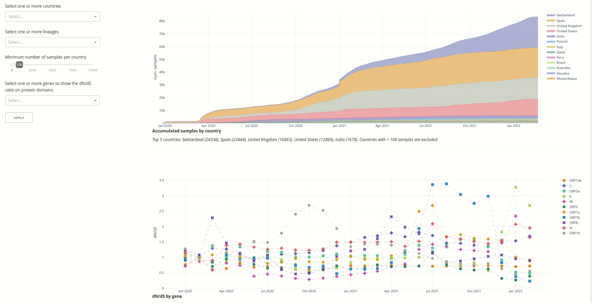
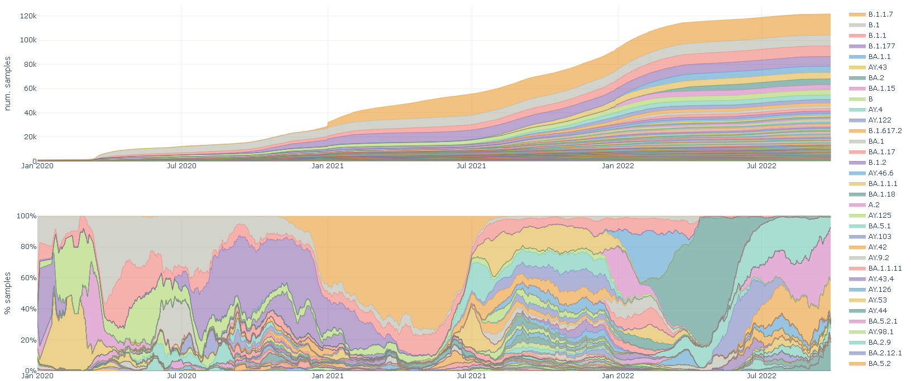
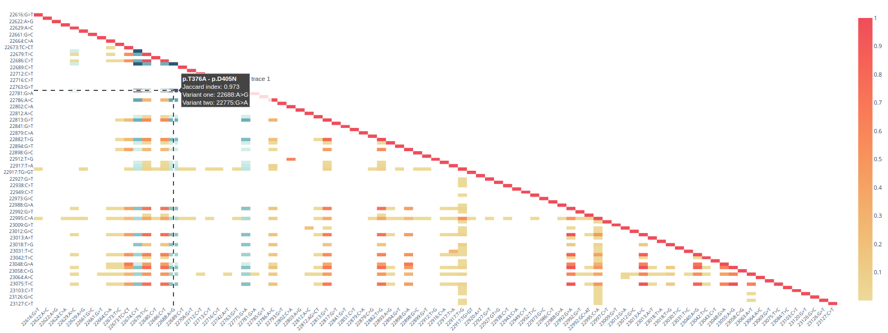

-----------------

# Dashboard

The Covigator dashboard provides the ability to navigate through a series of interactive plots that visualise 
SARS-CoV-2 mutations derived from the ENA  and COVID-19 Data Portal datasets. Our aim is to enable users to understand trends in the dataset of mutations in its 
geographical and temporal context.

Here we describe how to use and interpret the plots in the dashboard.
The dashboard is organized in tabs, here we explore each of the tabs.

**Table of Contents**

1. [How to use an interactive Dash plot](#how-to-use-an-interactive-dash-plot)
2. [Overview tab](#overview-tab)
3. [Samples tab](#samples-tab)
4. [Lineages tab](#lineages-tab)
5. [Mutation statistics tab](#mutation-statistics-tab)
6. [Recurrent mutations tab](#recurrent-mutations-tab)
7. [Intrahost mutations tab](#intrahost-mutations-tab)
8. [Download the raw data](#download-the-raw-data)

## How to use an interactive Dash plot

Plotly provides several interactive features, some are more intuitive than others, here we show how to zoom and
filter data. This is applicable on all plots in CoVigator.

### Zooming

You can zoom into any region of a plot. Click and drag on the plot to zoom-in and double-click to reset. 

### Filtering

Elements from a plot can be filtered out from the legend. A single click filters out the clicked element.
A double click filters out all other elements except the clicked one. Another double click will reset filters.

## Overview tab

The first tab in both dashboards show a set of statistics that help to assess the quality of the dataset.
These are different between ENA and COVID-19 Data Portal.

### ENA plots

* **Library strategies**. The distribution of samples across different library strategies (ie: WGS, WGA and 
  targeted-capture).
  * X-axis: library strategy
  * Y-axis: number of samples
* **Number of reads**. The number of reads before and after trimming was applied for each sample.
  * X-axis: number of reads after trimming
  * Y-axis: number of reads before trimming
* **Coverage**. The relation between horizontal and vertical coverage for each sample. 
  * X-axis: mean depth of coverage per sample (ie: vertical coverage)
  * Y-axis: % of genome covered with at least one read per sample (ie: horizontal coverage)
* **Mean mapping quality versus base calling quality**. The relation between the mean mapping quality and the mean base 
  call quality for each sample.
  * X-axis: mean base call quality per sample (this is a Phred score)
  * Y-axis: mean mapping quality per sample (this is a Phred score)

### COVID-19 Data Portal plots

* **Horizontal coverage**. The distribution of the horizontal coverage. 
  * X-axis: horizontal coverage %
  * Y-axis: number of samples in logarithmic scale
* **Ratio of N and ambiguous bases**. The FASTA format supports ambiguous bases in the form of Ns or other ambiguous 
  categories that refer to more than one nucleotide base. The ambiguous sequence is unusable for our purposes.
  * X-axis: ratio of N and ambiguous bases over sequence length
  * Y-axis: number of samples in logarithmic scale

## Samples tab

The aim of this tab is to explore the accumulation of samples on different countries through time. 
We also use the [dN/dS ratio](https://en.wikipedia.org/wiki/Ka/Ks_ratio) as an estimation of the evolutionary pressure 
and enable monitoring any change through time and location.

### Filters

* **Countries**. Select one or more countries to explore, if none are provided all are shown
* **Lineages**. Select one or more SARS-CoV-2 lineages to explore, if none are provided all are shown
* **Minimum number of samples per country**. When no countries are provided then this threshold is applied to exclude 
  countries with fewer samples
* **Genes**. Select one or more genes on which to explore the dN/dS. When provided also the Pfam protein domains for the 
  selected gene are shown

### Plots

* **Accumulated samples by country**. Area plot showing the accumulation of samples for each country. 
  * X-axis: sample collection date
  * Y-axis: number of samples
* **dN/dS by gene**. Line plot showing the evolution of the dN/dS ratio on different genomic regions. 
  * X-axis: time binned by months
  * Y-axis: dN/dS ratio

## Lineages tab

The aim of this tab is to explore the evolution of SARS-CoV-2 lineages on different countries through time.

### Filters

* **Countries**. Select one or more countries to explore, if none are provided all are shown
* **Lineages**. Select one or more SARS-CoV-2 lineages to explore, if none are provided all are shown

### Plots

* **Accumulated lineages by country**. Area plot showing the accumulation of samples for each country. 
  * X-axis: sample collection date
  * Y-axis: number of samples
* **Stacked lineages by country**. Stacked plot showing the prevalent lineage at each time point. 
  * X-axis: sample collection date
  * Y-axis: percentage of samples

## Mutation statistics tab

The aim of this tab is to show genome wide statistics on both datasets and on different genomic regions.
These statistics have been widely described in the literature and hence can act as quality controls of the results shown
in CoVigator. Also, some of these observations are coherent with biological knowledge.

### Filters

* **Genes**. Select one or more genes
* **Variant type**. Choose Single Nucleotide Variant (SNV), Multi Nucleotide Variant (MNV), insertion or deletion

### Plots

* **Mutations per sample**. Distribution of the number of mutations per sample. 
  * X-axis: number of mutations
  * Y-axis: number of samples 
  * Median number of mutations by sample indicated by dashed line, shadowed area indicates the region between the first and third quartiles.
* **Top mutations**. Most frequent DNA substitutions. 
  * X-axis: number of samples
  * Y-axis: substitution 
  * While for SNVs there are only 12 possible substitutions, the possible insertions or deletions are unbounded. This plot shows a maximum of 
    12 substitutions.
* **Indel length distribution**.The length distribution of insertions and deletions. Negative lengths 
  correspond to deletions and positive lengths to insertions. Darker bars indicate in-frame indels. 
  * X-axis: indel length in DNA base pairs
  * Y-axis: number of samples
* **Most common mutation effects**. Shows the number of times each mutation effect has been observed. 
  * X-axis: mutation effect as provided by SnpEff in Sequence Ontology terms
  * Y-axis: number of mutations in logarithmic scale

## Recurrent mutations tab

The aim of this tab is to facilitate the exploration of most common mutations through time. 
We show how the frequency of each mutation evolves month by month. For instance, we have observed the raise 
and decline of the mutations unique to the Alpha strain. We also provide a genomic browser that helps to visualize 
genes and protein domains together with the abundance of mutations in each region and ConsHMM conservation scores.
Also, when a given gene is selected we perform a co-occurrence clustering of mutations that help to identify mutations
that most frequently co-occur.

### Filters

* **Gene**. Select one gene
* **Protein domain**. Select one protein domain
* **Top occurring mutations table**
  * **Number of top occurring mutations**. The number of mutations to show in the table
  * **Metric to measure the abundance of a mutation in a month**. Choose either counts of observations or frequency within
    the month
  * **Start and end date**. By default the last 10 months are shown, this range can be changed. Bear in mind that if none 
    of the top mutations was observed at a given month, that month will not appear in the table.
* **Genome view**
  * **Bin size**. The size of the binning in base pairs for the mutation abundance and conservation tracks. It makes sense 
    to decrease the bin size for exploring smaller regions.
* **Co-occurrence matrix**
  * **Co-occurrence metric**. The metric to be used for each pairwise comparison in the co-occurrence matrix
  * **Minimum number of pairwise co-occurrences**. Pairs of mutations with a number of co-occurrent observations below this 
    number are ignored, ie: assumed to be zero.
* **Mutation clustering**
  * **The number of samples in the neighbourhood to consider for a cluster core sample**. This is a parameter for the
    OPTICS clustering algorithm.

### Plots

* **Top occurring mutations table**. A table with the top occurring mutations including information on the amino-acid change,
  the mutation effect, the total frequency and number of observations of the mutation, plus the monthly counts or 
  frequency. Mutations selected in this table will be highlighted in the other plots in this tab.
* **Genome/gene view**. This plot shows by default the genome view with the SARS-CoV-2 genome including seven tracks: 
  the binned abundance of mutations including repetitions, the binned abundance of unique mutations, three ConsHMM 
  conservation tracks corresponding to conservation within SARS-CoV-2, conservation with other SARS-like beta CoV and 
  conservation with other vertebrate CoV; finally two more tracks with the genes and Pfam protein domains. When a gene 
  or protein domain is selected the gene view is shown and the first two tracks with the abundance of mutations are 
  replaced by a scatter plot with the mutations themselves and their frequency in the Y-axis.
  * X-axis: genomic coordinates in base pairs
* **Co-occurrence matrix**. A heatmap showing the pairwise co-occurrence between mutations. This plot is only available when 
  a gene or protein domain has been selected; and only for the ENA dataset.
* **Co-occurrence clustering**. The list of clusters with all the mutations within each cluster.

## Intrahost mutations tab

**NOTE**: only available for ENA dataset

The aim of this tab is to enable the exploration of intrahost mutations.
In CoVigator we classify as intrahost all mutation observations with a VAF below 50 %. 
We then apply a set of filtering criteria on samples and mutations to obtain a high quality dataset of intrahost 
variant calls.
The same mutation can be observed as intrahost or clonal (VAF >= 80 %) in different samples. 
Here we want to focus on those mutations observed as intrahost mutations that were never observed as clonal mutations.
We rank the intrahost mutations by a score that combines the ConsHMM conservation and the observation count. 
Alternatively, the list of intrahost mutations can be sorted by observation count, ConsHMM or VAF only.
If an intrahost mutation is selected we show the different library strategies with which the mutation was observed, 
the temporal distribution across countries and finally the top 10 co-occurring clonal mutations.

### Filters

* **Gene**. Select one gene
* **Protein domain**. Select one protein domain
* **Minimum VAF subclonal mutations**. The threshold on the variant allele frequency
* **Number of top occurring intrahost mutations**. The number of intrahost mutations in the table
* **Order metric**. Intrahost mutations can be ordered by a joint score of count of observations and conservation, by 
  conservation uniquely, by count of observations uniquely or by VAF.

### Plots

* **Mutations only observed as intrahost**. Any mutation that has been observed in clonal state (ie: VAF > 80 %) will not 
  be present in this table, no matter how many intrahost observations. This table includes information on the 
  amino-acid change, the mutation effect, first and last observation dates, plus some of the scores discussed above.
* **Library strategies distribution** 
  * X-axis: library strategy
  * Y-axis: number of samples
* **Countries distribution** 
  * X-axis: sample collection date
  * Y-axis: number of samples
* **Top 10 co-occurring clonal mutations**

## Download the raw data

The download section provides the raw data generated by the CoVigator pipeline as it is stored in the database.
This includes the variant calls for every sample in each dataset, its metadata and lineage annotations.

Only the latest data release is available for download, we do not maintain a history of data versions.

Unfortunately the data is not in the standard VCF format and the format of the table may change in the future.
Also, we do not provide the BAM files for download.
We internally store all VCF and BAM files, we are happy to attend specific and justified data requests via issues in 
our GitHub site.
