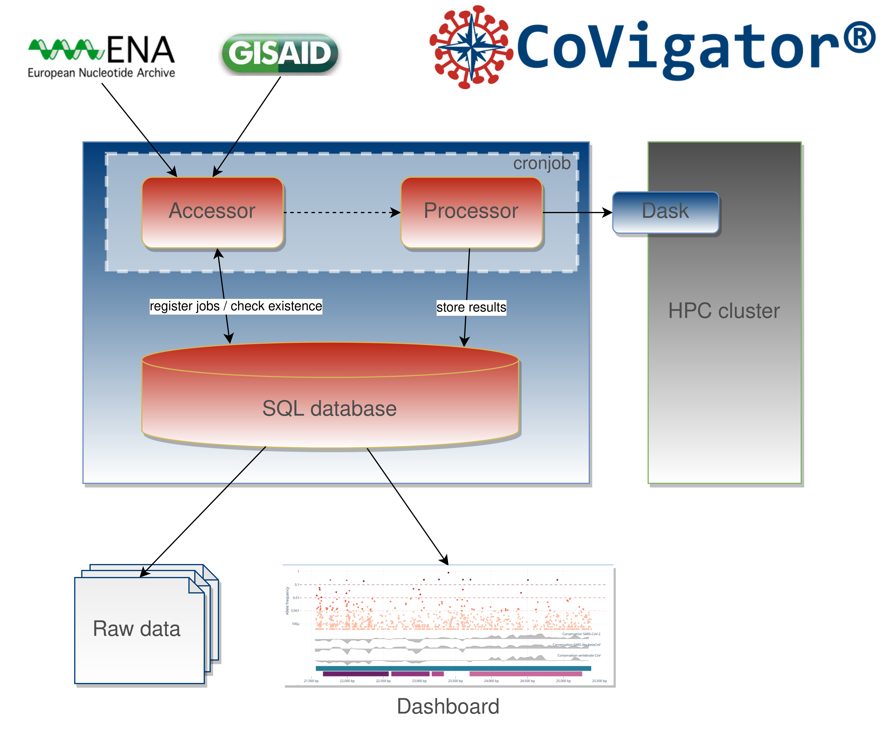

-----------------

# Knowledge base


[](https://github.com/TRON-Bioinformatics/covigator/actions/workflows/unit_tests.yml)
[](https://dash.plotly.com/)
[](https://opensource.org/licenses/MIT)

The Covigator knowledge base holds all the results that are shown in the dashboard.
It is responsible for orchestrating the update of data from ENA and GISAID into the final results.
It acts as the backend for all of CoVigator.

Here we describe what the knowledge base is in charge of and how to operate it.

**Table of Contents**

1. [System components](#id1)
2. [How to install](#id2)
3. [How to configure](#id3)
4. [How to run](#id4)
5. [Sample inclusion criteria](#id5)


## System components

The CoVigator knowledge base has several components:

* **Accessor**. The process in charge of fetching raw data from ENA and GISAID and store it in the database.
* **Processor**. The process in charge of processing the raw data through the pipeline and storing the results.
* **Database**. The database where raw data and results are stored.

CoVigator interacts with other systems not part of CoVigator per se:

* **High Performance Computing (HPC) cluster**. The computational resources where the processing of data actually happens. 
  CoVigator can run without this, but it is required in order to scale out processing to multiple servers.
* **European Nucleotide Archive (ENA) Application Programming Interface (API)**. The accessor queries the ENA API to fetch 
  new samples periodically. This process can be fully automated.
* **GISAID database**. The accessor relies on a manual download from GISAID before updating any data.



All automated data download performs MD5 checksums to ensure data integrity. Also, all network requests implement
an exponential backoff retry mechanism to minimise failures in a non reliable network.

## How to install

CoVigator is a Python package, install as follows:
```
pip install covigator
```

## How to configure

CoVigator is configured through environment variables.

### Database configuration

- `COVIGATOR_DB_HOST` : the host of the database (default value 0.0.0.0)
- `COVIGATOR_DB_NAME` : the database name inside Postgres (default value: covigator)
- `COVIGATOR_DB_USER` : the database user (default value: covigator)
- `COVIGATOR_DB_PASSWORD` : the database password (default value: covigator)
- `COVIGATOR_DB_PORT` : the database port (default value: 5432)
- `COVIGATOR_DB_POOL_SIZE` : the database pool size (default value: 5)
- `COVIGATOR_DB_MAX_OVERFLOW` : the database max overflow (default value: 10)
- `COVIGATOR_TABLE_VERSION` : this suffix is appended to all table names when provided

### File system storage

- `COVIGATOR_STORAGE_FOLDER` : the storage folder where the pipeline results for each sample are stored
- `COVIGATOR_TEMP_FOLDER` : the temp folder
- `COVIGATOR_DOWNLOAD_CONTENT_FOLDER` : the files in this folder will be available for download in the download tab

### Dashboard

- `COVIGATOR_DASHBOARD_HOST` : the host where the dashboard is available
- `COVIGATOR_DASHBOARD_PORT` : the port where the dashboard is available

### Logs

- `COVIGATOR_DASHBOARD_LOG_FILE` : the dashboard log file
- `COVIGATOR_PROCESSOR_LOG_FILE` : the processor log file
- `COVIGATOR_ACCESSOR_LOG_FILE` : the accessor log file

### Pipeline

- `COVIGATOR_NEXTFLOW` : the nextflow binary
- `COVIGATOR_WORKFLOW` : the path to the CoVigator nextflow workflow
- `COVIGATOR_FORCE_PIPELINE` : a flag that indicates when the pipeline needs to rerun, otherwise results are reloaded 
  in the database. This is useful is the database model has changes to reload all data without fully reprocessing all 
  samples.
- `COVIGATOR_MAX_SNVS` : all samples with a number of SNVs above this number are excluded
- `COVIGATOR_MAX_INSERTIONS` : all samples with a number of insertions above this number are excluded
- `COVIGATOR_MAX_DELETIONS` : all samples with a number of deletions above this number are excluded
- `COVIGATOR_REF_FASTA` : the reference fasta file (a default SARS-CoV-2 reference genome is provided)
- `COVIGATOR_DASK_PORT` : the port where the dask dashboard will be available
- `COVIGATOR_LOW_COVERAGE_THR` : VAF threshold for low frequency mutations (default: 0.05)
- `COVIGATOR_SUBCLONAL_THR` : VAF threshold for subclonal mutations (default: 0.8)
- `COVIGATOR_WORKFLOW_CPUS` : number of CPUs per sample (default: 1)
- `COVIGATOR_WORKFLOW_MEMORY` : memory per sample (default: 3g)

### Sample exclusion

- `COVIGATOR_MEAN_MQ_THR` : samples with a mean MQ below this value will be excluded (default: 10)
- `COVIGATOR_MEAN_BQ_THR` :  samples with a mean BQ below this value will be excluded (default: 10)
- `COVIGATOR_HORIZONTAL_COVERAGE_THR` : samples with an horizontal coverage below this value will be excluded (default: 20 %)

## How to run

### Accessor


#### ENA

`covigator-ena-accessor --tax-id 2697049 --host-tax-id 9606`

- The organism taxonomic identifier (eg: for SARS-CoV-2 the taxonomic identifier is 2697049)
- The host organism taxonomic identifier (eg: for Homo sapiens the taxonomic identifier is 9606)

The taxonomic identifiers for the different organisms is available through EMBL-EBI as described here https://ena-docs.readthedocs.io/en/latest/retrieval/programmatic-access/taxon-api.html or through NCBI here https://www.ncbi.nlm.nih.gov/taxonomy.

Only for ENA an additional step to download samples is required. This has been removed from the processor as 
distributed downloading does not scale up as well as processing does.

`covigator-download`

#### GISAID

`covigator-gisaid-accessor --input-fasta gisaid_dna.fasta --input-metadata gisaid.tsv`

The input files for GISAID need to be downloaded manually from GISAID site after accepting their license.

### Processor

The processor is in charge of orchestrating the load of samples into the database. 
The processor is intended to run periodically.
This jobs created by the accessor are the starting point for the processor which orchestrates the flow of the job 
through its life cycle.

The happy path of a job is the following:
- `PENDING`: newly created job by the accessor
- `DOWNLOADED`: in the case of ENA samples there is an intermediate state for the download
- `QUEUED`: the job has already been read by the processor and the subsequent actions are scheduled
- `FINISHED`: final state
  
There are two self-descriptive failure states
- `FAILED_PROCESSING`
- `EXCLUDED`

The above workflow is orchestrated using the dask library and a Slurm cluster behind the scenes. The cluster 
configuration is specific to Dask, thus Covigator could be integrated into other clusters than Slurm. 
See Dask documentation on cluster configuration for more details 
http://jobqueue.dask.org/en/latest/configuration.html#configuration-files.
Also, it can run on a single computer without any cluster by specifiying the number of available CPUs. 


```
covigator-processor --source ENA|GISAID
```

**Parameters**
- `--source` The data source to process. Possible values: ENA, GISAID. Required: true
- `--num-jobs` The number of dask jobs to spin, this corresponds to the number of whole nodes requested to the cluster. Default: 1

To run locally out of a cluster use `--local` and `--num-local-cpus`.

### Dashboard

```
covigator-dashboard
```

## Sample exclusion criteria

Exclusion criteria common to ENA and GISAID:
1. Non human host. All samples with a non human host are excluded
2. Collection date prior to December 2019
3. Horizontal genome coverage below 20%

Exclusion criteria for ENA samples:
1. Non Illumina samples. Notice that this excludes all of Nanopore sequencing data. 
This may change in the future.
2. Only WGA, WGS and targeted sequencing samples. Other library strategies such as RNA-seq are excluded.
3. Missing URL to raw FASTQ data
4. Mean mapping quality below 10
5. Mean base call quality below 10

Exclusion criteria for GISAID samples:
1. Ratio of ambiguous bases (ie: N and other ambiguous IUPAC codes) greater than 0.2


